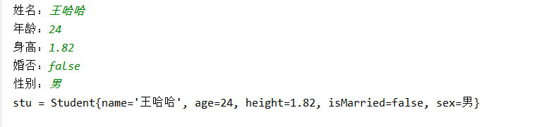
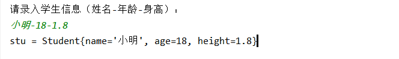

```java
作业规范【必读】

命名要求：
	1. 类名，接口名，枚举名，注解名使用大驼峰
	2. 变量名，方法名，包名均使用小驼峰
	3. 常量名全大写，多个单词下划线分割
	4. 名字要见名知意，如果不知道对应的英文，可以使用拼音代替。不可使用无意义字符
  
代码规范：
	格式要良好，使用IDEA格式化缩进（快捷键：Ctrl+Alt+L）
  
答题规范：
	1. 每道题完整代码请贴入对应题目中的代码区。
    2. 如果有运行结果的，请把代码运行结果放到文档中
```


# 【BigDecimal类】

## 题目1

有以下double数组：

```java
double[] arr = {0.1,0.2,2.1,3.2,5.56,7.21};
```

请编程计算它们的总值及平均值(四舍五入保留小数点后2位)

**思路：**

1. 定义一个BIgDecimal变量用来接收总和
2. 遍历将数组元素都转换为BigDecimal，并累加到总和
3. 打印总和
4. 计算平均值，打印平均值

~~~java
//遍历double类型的数组，对数组中的所有元素求和
//平均值 =  总和 / 数组长度
~~~


**答案：**

```java
package _01泛型.test01;
import java.math.BigDecimal;
import java.math.RoundingMode;

public class Demo01 {
    public static void main(String[] args) {
        double[] arr = {0.1, 0.2, 2.1, 3.2, 5.56, 7.21};
       
        //1. 定义一个BIgDecimal变量用来接收总和
        BigDecimal sum = new BigDecimal(0);
        //2. 遍历将数组元素都转换为BigDecimal，并累加到总和
        for (int i = 0; i < arr.length; i++) {
            sum = sum.add(new BigDecimal(arr[i] + ""));
        }
        
        //3. 打印总和
        System.out.println("总值 = " + sum.doubleValue());
        
        //4. 计算平均值，打印平均值
        BigDecimal len = new BigDecimal(arr.length);
        //两位小数，四舍五入
        BigDecimal average = sum.divide(len, 2, RoundingMode.HALF_UP);
        System.out.println("平均值 = " + average);
    }
}

```

**执行结果：**

```java
总值 = 18.37
平均值 = 3.06
```


# 【Arrays类】

## 题目2

有以下数组定义：

```java
int[] arr = {1,332,43,25,3324,34,335,4,45,2,43,52,54};
```

 要求：

-  请打印数组所有元素
-  请对数组元素进行“升序”排序
-  请对排序后的数组再次打印。

思路:

- 借助Arrays的sort，toString方法完成

**答案：**

```java
package _02Arrays.test02;

import java.util.Arrays;

public class Demo01 {
    public static void main(String[] args) {
        int[] arr = {1,332,43,25,3324,34,335,4,45,2,43,52,54};
        
        //- 请打印数组所有元素
        System.out.println(Arrays.toString(arr));
        
        //- 请对数组元素进行“升序”排序
        Arrays.sort(arr);//arr是一个引用类型（传递的是地址值） sort方法是对当前地址下存储的元素进行排序
        
        //- 请对排序后的数组再次打印。
        System.out.println(Arrays.toString(arr));
    }
}

```

打印结果：

```java
[1, 332, 43, 25, 3324, 34, 335, 4, 45, 2, 43, 52, 54]
[1, 2, 4, 25, 34, 43, 43, 45, 52, 54, 332, 335, 3324]
```


# 【包装类】

## 题目3

请定义学员类，有以下成员属性：

​       姓名：String类型
​       年龄：int
​       身高：double
​       婚否：boolean
​       性别：char

请从控制 台接收以下数据：
​       姓名：王哈哈
​       年龄：24
​       身高：1.82
​       婚否：false
​       性别：男
以上数据要求全部使用String类型接收
请创建“学员对象”，并将所有数据转换后，存储到这个对象中，最后打印此对象的所有属性。


**答案：**

思路：

1. 键盘录入对应学员属性信息，转换为对应的基本数据类型进行设置

步骤：

1. 创建学员类
2. 创建测试类，创建学员对象
3. 键盘录入属性信息，转换为基本数据类型后设置到学员对象
4. 打印学员对象信息

学生类：

```java
package _03包装类.test4;

public class Student {
    private String name;
    private int age;
    private double height;
    private boolean isMarried;
    private char sex;

    public Student() {
    }

    public Student(String name, int age, double height, boolean isMarried, char sex) {
        this.name = name;
        this.age = age;
        this.height = height;
        this.isMarried = isMarried;
        this.sex = sex;
    }

    public String getName() {
        return name;
    }

    public void setName(String name) {
        this.name = name;
    }

    public int getAge() {
        return age;
    }

    public void setAge(int age) {
        this.age = age;
    }

    public double getHeight() {
        return height;
    }

    public void setHeight(double height) {
        this.height = height;
    }

    public boolean isMarried() {
        return isMarried;
    }

    public void setMarried(boolean married) {
        isMarried = married;
    }

    public char getSex() {
        return sex;
    }

    public void setSex(char sex) {
        this.sex = sex;
    }

    @Override
    public String toString() {
        return "Student{" +
                "name='" + name + '\'' +
                ", age=" + age +
                ", height=" + height +
                ", isMarried=" + isMarried +
                ", sex=" + sex +
                '}';
    }
}
```

测试类：

```java
package _03包装类.test4;

import java.util.Scanner;

public class Demo {
    public static void main(String[] args) {
        //1. 创建学员类
        //2. 创建测试类，创建学员对象
        Student stu = new Student();
        //3. 键盘录入属性信息，转换为基本数据类型后设置到学员对象
        Scanner sc = new Scanner(System.in);
        System.out.print("姓名：");
        String name = sc.nextLine();

        System.out.print("年龄：");
        String age = sc.nextLine();
        System.out.print("身高：");
        String height = sc.nextLine();
        System.out.print("婚否：");
        String isMarried = sc.nextLine();
        System.out.print("性别：");
        String sex = sc.nextLine();

        //把接收的数据，填充到Student对象中
        stu.setName(name);
        stu.setAge(Integer.parseInt(age));//String => int
        stu.setHeight(Double.parseDouble(height));//String => double
        stu.setMarried(Boolean.parseBoolean(isMarried));//String => boolean
        stu.setSex(sex.charAt(0));//String => char


        //4. 打印学员对象信息
        System.out.println("stu = " + stu);
    }
}


```

打印结果：

 

**运行结果：**

```java
姓名：王哈哈
年龄：24
身高：1.82
婚否：false
性别：男
stu = Student{name='王哈哈', age=24, height=1.82, isMarried=false, sex=男}
```


# 【String类】

## 题目4

键盘录入一段字符串，字符串包含一个学生的姓名，年龄，身高信息。这三个信息以中划线分隔，例如：

```java
张三-18-180
    
1. 录入字符串    
2. 按照 - 切割字符串    {"张三","18","180"}
3. 把切割后的字符串，作为数据值，填充到学生对象中
```

定义学生类包含属性姓名，年龄，身高，将上述字符串转换为学生对象。打印对象，将对象的属性信息显示出来。

**答案：**

思路：

```java
先去创建学生类
创建测试类，在测试类里面键盘输入字符串，将字符串的信息切割得到对应信息转换为学生对象的属性值
```

步骤：

1. 先把学生类定义出来
2. 定义测试类，写出main方法
3. main方法中创建学生对象，创建键盘录入的对象
4. 键盘录入字符串
5. 切割解析字符串，并设置到对象
6. 打印对象信息

学生类：

```java
package _04String;

public class Student {
    private String name;
    private int age;
    private double height;

    public Student() {
    }

    public Student(String name, int age, double height) {
        this.name = name;
        this.age = age;
        this.height = height;
    }

    public String getName() {
        return name;
    }

    public void setName(String name) {
        this.name = name;
    }

    public int getAge() {
        return age;
    }

    public void setAge(int age) {
        this.age = age;
    }

    public double getHeight() {
        return height;
    }

    public void setHeight(double height) {
        this.height = height;
    }

    @Override
    public String toString() {
        return "Student{" +
                "name='" + name + '\'' +
                ", age=" + age +
                ", height=" + height +
                '}';
    }
}

```

测试类：

```java
package _04String;

import java.util.Scanner;

public class Demo {
    public static void main(String[] args) {
        //1. 先把学生类定义出来
        //2. 定义测试类，写出main方法
        //3. main方法中创建学生对象，创建键盘录入的对象
        Student stu = new Student();
        Scanner sc = new Scanner(System.in);
        //4. 键盘录入字符串
        System.out.println("请录入学生信息（姓名-年龄-身高）：");
        String data = sc.nextLine(); //data中存储的内容 ： 张三-18-180
        
        //5. 切割解析字符串，并设置到对象
        String[] msg = data.split("-");//msg={"张三","18","180"}
        
        stu.setName(msg[0]);
        stu.setAge(Integer.parseInt(msg[1]));
        stu.setHeight(Double.parseDouble(msg[2]));
        
        //6. 打印对象信息
        System.out.println("stu = " + stu);
    }
}
```

**打印结果：**

 

```
请录入学生信息（姓名-年龄-身高）：
小明-18-1.8
stu = Student{name='小明', age=18, height=1.8}
```


# 【Collection+迭代器】

## 题目5

请定义一个Collection类型的集合，存储以下字符串：

```
  "JavaEE企业级开发指南"
  "Oracle高级编程"
  "MySQL从入门到精通"
  "Java架构师之路"
```

请编程实现以下功能：

- 使用迭代器遍历所有元素，并打印
- 使用迭代器遍历所有元素，筛选书名小于10个字符的，并打印；
- 使用迭代器遍历所有元素，筛选书名中包含“Java”的，并打印
- 如果书名中包含“Oracle”，则删掉此书。删掉后，遍历集合，打印所有书名。

​       (注意：以上功能写在一个main()方法中，但请单独实现)


**答案：**

思路分析：

1. 因为Collection是接口，创建对象需要借助子类型完成
2. 迭代器使用完后，如果要继续使用需要获取新的

步骤：

1. 使用子类型ArrayList定义Collection类型对象
2. 将字符串数据加到集合中
3. 按题目要求完成对应业务


```java
package _05Collection_迭代器;

import java.util.ArrayList;
import java.util.Collection;
import java.util.Iterator;

public class Demo01 {
    public static void main(String[] args) {
        //1. 使用子类型ArrayList定义Collection类型对象
        Collection<String> coll = new ArrayList<>();
        //2. 将字符串数据加到集合中
        coll.add("JavaEE企业级开发指南");
        coll.add("Oracle高级编程");
        coll.add("MySQL从入门到精通");
        coll.add("Java架构师之路");

        //3. 按题目要求完成对应业务
        //- 使用迭代器遍历所有元素，并打印
        Iterator<String> iter1 = coll.iterator();
        while (iter1.hasNext()) {
            String book = iter1.next();
            System.out.println(book);
        }
        
        
        

        System.out.println("--------------------------");
        //- 使用迭代器遍历所有元素，筛选书名小于10个字符的，并打印；
        Iterator<String> iter2 = coll.iterator();
        while (iter2.hasNext()) {
            //记住：在遍历过程中，仅使用1次next()获取元素值
            String book = iter2.next();

            if (book.length() < 10) {
                System.out.println(book);
            }
        }


        System.out.println("--------------------------");
        //- 使用迭代器遍历所有元素，筛选书名中包含“Java”的，并打印
        Iterator<String> iter3 = coll.iterator();
        while (iter3.hasNext()) {
            String book = iter3.next();
            
            //判断字符串（书名）中是否包含子字符串"Java"
            if (book.contains("Java")) {
                System.out.println(book);
            }
        }


        System.out.println("--------------------------");
        //- 如果书名中包含“Oracle”，则删掉此书。删掉后，遍历集合，打印所有书名。

        Iterator<String> iter4 = coll.iterator();
        while (iter4.hasNext()) {
            String book = iter4.next();
            
            if (book.contains("Oracle")) {
                //注意事项：不允许使用"集合对象.remove()"
                //迭代器遍历时，删除元素使用：迭代器对象.remove()
                iter4.remove();
            }
        }

        Iterator<String> iter5 = coll.iterator();
        while (iter5.hasNext()) {
            String book = iter5.next();
            System.out.println(book);
        }

        
        System.out.println("--------------------------");

    }
}

```

**打印结果：**

```
JavaEE企业级开发指南
Oracle高级编程
MySQL从入门到精通
Java架构师之路
--------------------------
Java架构师之路
--------------------------
JavaEE企业级开发指南
Java架构师之路
--------------------------
JavaEE企业级开发指南
MySQL从入门到精通
Java架构师之路
--------------------------
```

 


# 【增强for】

## 题目6

请定义一个Collection类型的集合，存储以下分数信息：

```java
88.5,39.2,77.1,56.8,89,99,59.5
```

请编程实现以下功能：

- 使用增强for遍历所有元素，并打印
- 使用增强for遍历所有元素，打印不及格的分数；
- 使用增强for遍历所有元素，计算不及格的分数的数量，和平均分，并打印计算结果。
- 使用增强for遍历所有元素，求出最高分，并打印；


(注意：以上所有功能写在一个main()方法中，但请单独实现)


**答案：**

思路：

	1. 先定义集合将题中数字存入。
 	2. int不能直接转换为Double，可以在整数后面加d表示该数是double数据。如 80d
 	3. 按题目要求实现

步骤：

1. 借助子类创建Collection集合对象
2. 将题目中的小数添加到里面
3. 按题目要求实现

```java
package _06增强for;

import java.util.ArrayList;
import java.util.Collection;

public class Demo01 {
    public static void main(String[] args) {
        //1. 借助子类创建Collection集合对象
        Collection<Double> coll = new ArrayList<>();//集合对象中只能存储引用类型
        //2. 将题目中的小数添加到里面
        coll.add(88.5);//自动装箱： coll.add( Integer.valueOf(88.5) )
        coll.add(39.2);
        coll.add(77.1);
        coll.add(56.8);
        coll.add(89d);
        //集合中是Double，int不能自动转为Double.
        //整数后面加d表示该数是double数据
        coll.add(99d);
        coll.add(59.5);
        //3. 按题目要求实现
        //- 使用增强for遍历所有元素，并打印
        for (Double score : coll) {
            System.out.println("score = " + score);

        }
        System.out.println("-----------------");
        
        
        
        //- 使用增强for遍历所有元素，打印不及格的分数；
        for (Double score : coll) {
            if (score < 60) {
                System.out.println("分数：" + score);
            }

        }
        System.out.println("-----------------");
        //- 使用增强for遍历所有元素，计算不及格的分数的数量，和平均分，并打印计算结果。
        int count = 0;//不及格数量
        double sum = 0;//总分
        double avg = 0;//平均分

        for (Double score : coll) {
            if (score < 60) {
                count++;
            }
            sum += score;
        }

        System.out.println("不及格数量：" + count);
        avg = sum / coll.size();
        System.out.println("平均分：" + avg);


        //- 使用增强for遍历所有元素，求出最高分，并打印；
        double max = 0;//最高分
        for (Double score : coll) {
            if (score > max) {
                max = score;
            }
        }
        System.out.println("max = " + max);
    }
}

```

**打印结果：**

```
score = 88.5
score = 39.2
score = 77.1
score = 56.8
score = 89.0
score = 99.0
score = 59.5
-----------------
分数：39.2
分数：56.8
分数：59.5
-----------------
不及格数量：3
平均分：72.72857142857143
max = 99.0
```


